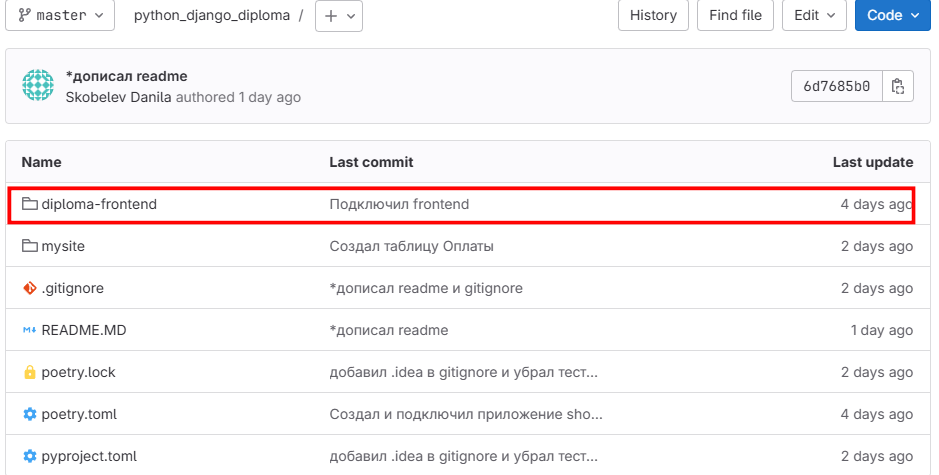

# Итоговый проект по Django(в основном DRF + готовый Frontend)

## Описание

### Цель проекта:

Практика по фреймворку Django и DRF.

### Задачи проекта:

Написание бекэнда под интернет-магазин и подключение к нему готового фронтенд-приложения

### Технологический стэк:

## Установка и запуск проекта

### Установка

- Стягиваем репозиторий 
- При отсутствии устанавливаем poetry `pip install poetry`
- Устанавливаем зависимости из корня проекта `poetry install --no-root`
- Подключаем фронтенд-пакет из директории diploma-frontend/:
  - Находим директорию diploma-frontend
  - 
  - Переходим в нее:
    - если вы находитесь в корневой папке проекта(на уровне где присутсвуют директории: mysite, diploma-frontend, README.MD, ...), то команда будет: `cd ./diploma-frontend/`
  - Находясь в директории diploma-frontend/ - выполняем следующие команды:
    - `python.exe -m pip install --upgrade pip`
    - `pip install dist/diploma-frontend-0.6.tar.gz `
  - В случае если на этом этапе вылетают исключение, рекомендую:
    - проверить из какой папки выполняются команды
    - убедиться в существовании файла diploma-frontend-0.6.tar.gz, находящегося по пути diploma-frontend/dist/
    - Ознакомиться с отдельным официальным README файлом по установке фронтенда для этого проекта, находящегося по адресу: https://gitlab.skillbox.ru/vrvrvvr_vrvrvrv/python_django_diploma/-/tree/master/diploma-frontend

### Запуск

- Запускаем проект в дебаг-режиме из директории mysite `python manage.py runserver`

## Способы использования проекта

